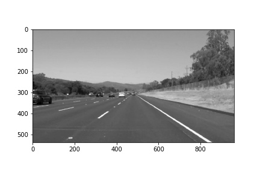
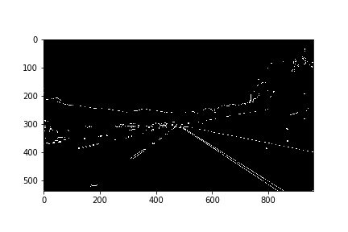
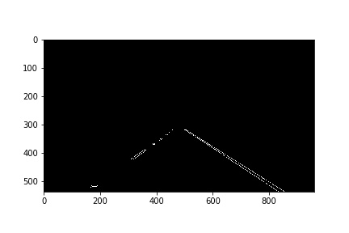
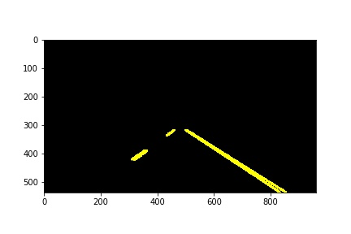
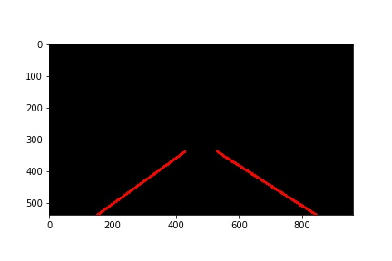
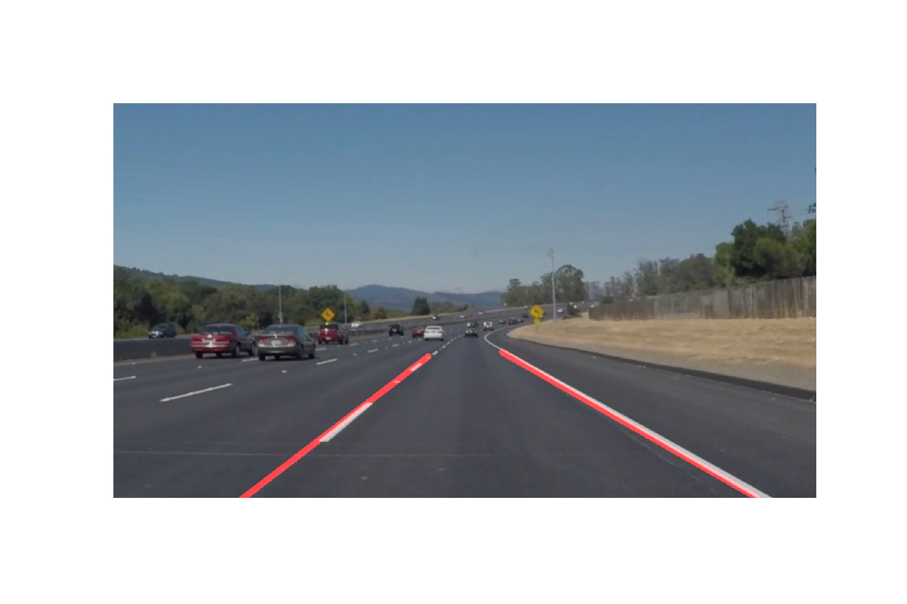

# **Finding Lane Lines on the Road** 

## Writeup Template

### You can use this file as a template for your writeup if you want to submit it as a markdown file. But feel free to use some other method and submit a pdf if you prefer.

---

**Finding Lane Lines on the Road**

The goals / steps of this project are the following:
* Make a pipeline that finds lane lines on the road
* Reflect on your work in a written report

[//]: # (Image References)

[image1]: ./examples/grayscale.jpg "Grayscale"

---

### Reflection

### 1. Describe your pipeline. As part of the description, explain how you modified the draw_lines() function.

My pipeline consisted of 5 steps. 

1. I converted the images to grayscale. Because the color information is not necessary for edge detection.

2. The Gaussian Blur operation is used to smooth the image.

3. Apply canny edge detection on the blurred image.

4. Select the region of interest, which contains the lane lines and ignore the rest part of the image.

5. Perform Hough transform on masked image to segment the corresponding lines.

6. Modify the draw_lines code to draw a single line based on each line.
   1. calculate the slope of all Hough lines
   2. retain the line whose absolute value of slope ranges from 0.5 to 2. Because we think that the angle between the lane lines and the horizontal plane is usually between 30 degrees and 60 degrees.
   3. divide all lines into two groups. The lines with negative slope belong to the left plane and the lines with positive slope are the right line.
   4. average all selected slopes of these two groups to find the mean slope of the left line and the right line.
   5. calculate the mean bias of these two groups
   6. calculate the appropriate vertices by using the value of slope and bias. 

7. Overlay the original image and the selected lines

### 2. Identify potential shortcomings with your current pipeline

1. One potential shortcoming could be that the marked lane lines jitter slightly as the vehicle moves forward. The possible reason is that the marked lane lines of this video are not completely coherent from frame to frame.
2. As I test my code with the challenge video, our marked lane line will disappear when the car is turning. The possible reasons are:
   1. The light of those frames is too strong and the contrast between the lane line and the ground decreases.
   2. We use four vertices to draw the quadrilateral region. But when cornering, the slope value of those points on the curved lanes varies. There is no way to fit all the relevant points with only one line.
3. My code works well on the first two videos. And if I use the 4 seconds subclip of the challenge video, it still works. But, the error 'signed integer is less than minimum' occurs, when I try to test my code on the whole challenge video. But I still haven't solved it. If you have any advice on this error, please let me know. 

### 3. Suggest possible improvements to your pipeline

1. Smooth the lane line of adjacent frames.
2. Apply image enhancement operation.
3. A possible improvement would be to use a higher degree polynomial for connecting line segments.

