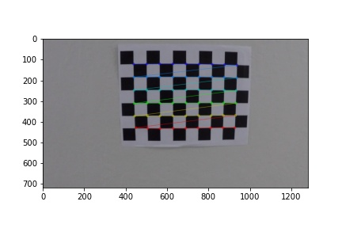
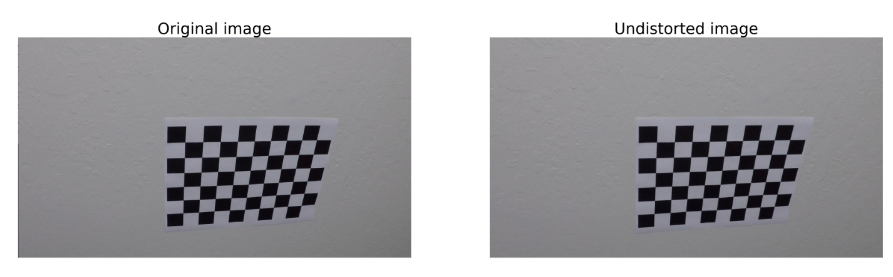
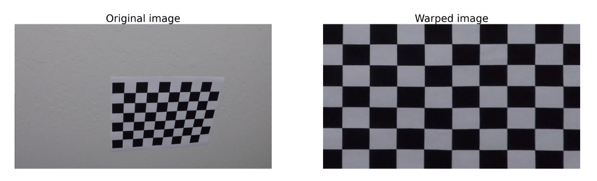
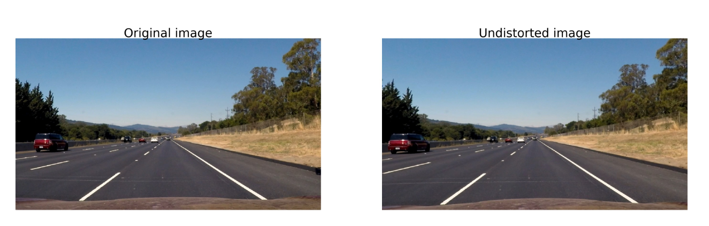
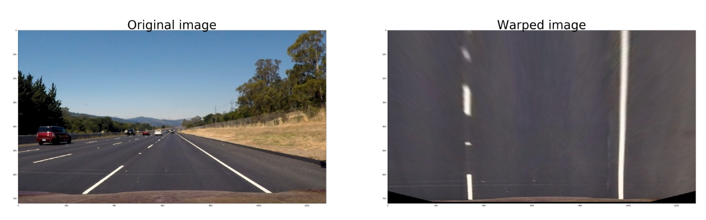
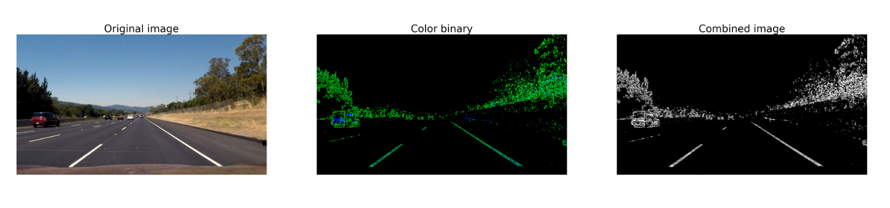
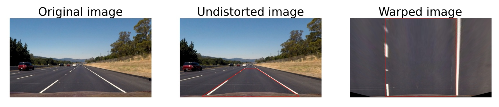
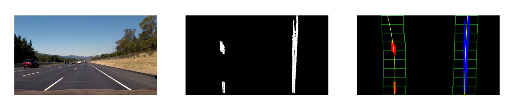
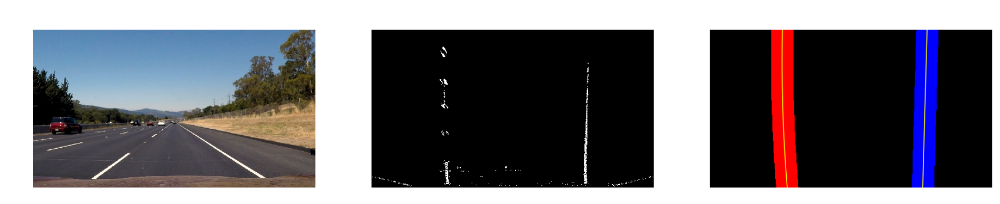
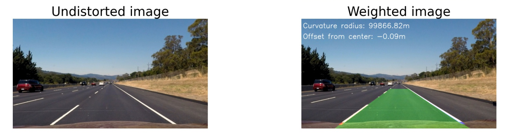

## Writeup - Advanced lane lines finding Project

---

The goals / steps of this project are the following:

* Compute the camera calibration matrix and distortion coefficients given a set of chessboard images.
* Apply a distortion correction to raw images.
* Use color transforms, gradients, etc., to create a thresholded binary image.
* Apply a perspective transform to rectify binary image ("birds-eye view").
* Detect lane pixels and fit to find the lane boundary.
* Determine the curvature of the lane and vehicle position with respect to center.
* Warp the detected lane boundaries back onto the original image.
* Output visual display of the lane boundaries and numerical estimation of lane curvature and vehicle position.

[//]: # (Image References)

[image1]: ./examples/undistort_output.png "Undistorted"
[image2]: ./test_images/test1.jpg "Road Transformed"
[image3]: ./examples/binary_combo_example.jpg "Binary Example"
[image4]: ./examples/warped_straight_lines.jpg "Warp Example"
[image5]: ./examples/color_fit_lines.jpg "Fit Visual"
[image6]: ./examples/example_output.jpg "Output"
[video1]: ./project_video.mp4 "Video"

## [Rubric](https://review.udacity.com/#!/rubrics/571/view) Points

### Here I will consider the rubric points individually and describe how I addressed each point in my implementation.  

---

### Camera Calibration
All helper functions of this part are stored in `calibration_utils.py`.

I start by preparing "object points", which will be the (x, y, z) coordinates of the chessboard corners in the world. Here I am assuming the chessboard is fixed on the (x, y) plane at z=0, such that the object points are the same for each calibration image.  Thus, `objp` is just a replicated array of coordinates, and `objpoints` will be appended with a copy of it every time I successfully detect all chessboard corners in a test image.  `imgpoints` will be appended with the (x, y) pixel position of each of the corners in the image plane with each successful chessboard detection. I use the `cv2.findChessboardCorners()` function to detect the chessboard corners. An example of chessboardcorners on the image is shown in fourth code cell in `P2.ipynb` and is shown below:
<center></center>

I then used the output `objpoints` and `imgpoints` to compute the camera calibration and distortion coefficients using the `cv2.calibrateCamera()` function. I applied this distortion correction to the test image using the `cv2.undistort()` function (fifth code cell in `P2.ipynb`) and obtained this result: 

<center></center>

After that, I used perspective transform method `cv2.getPerspectiveTransform` (sixth code cell `P2.ipynb`) with appropariate source and distination points to obtain a warped image:
<center></center>

### Pipeline (single images)

#### 1. Provide an example of a distortion-corrected image.

To demonstrate this step, I used the calculated camera matrix `mtx` and the distortion coefficient `dist` as well as the `cv2.undistort()` function (in `calibration_utils.py`) to obtain the undistorted image (9th code cell in `P2.ipynb`) like this one:

<center></center>

The same as above, we used perspective transform ( `perspective_transform_utils.py`) to get the warped image (10th code cell in `P2.ipynb`):
<center></center>


#### 2. Binary image (color transforms, gradients or other methods to create a thresholded binary image)
All helper functions of this part are stored in `binary_utis.py`.

I used a combination of color and gradient thresholds to generate a binary image (thresholding steps in `binary_utils.py`). After the comparison of the binary maps in RGB, HLS and HSV color space (12th and 13th code cells in `P2.ipynb`), We found that the lane lines in saturation color channel of HLS space are more obvious than in other channel and color space. Besides, after the comparison of absolute sobelx, sobely, the magnitude of gradient and the direction of gradient (15th code cell in `P2.ipynb`), we found that the thresholded magnitude gradient binary map outperforms the others. Furthermore, the combination of direction gradient and magnitude gradient works better than using magnitude gradient alone. So, we combined the binary map of the saturation channel of HLS and the gradient with both magnitude and direction threshold together to obtain the final binary map (17th code cell in `P2.ipynb`).
Here's an example of my output for this step:
<center></center>

#### 3. Perspective transform

The code for my perspective transform includes a function called `warped_test_images()` in `perspective_transform_utils.py`, which appears in 20th code cell in the file `P2.ipynb`. The `warped_test_images()` function takes as inputs an image (`undist`). And the source (`src`) and destination (`dst`) points are set manuelly. I chose the hardcode the source and destination points in the following manner:

```python
src = np.float32([[img_size[0]/2-60, img_size[1]/2+100], # upper left
                  [200, img_size[1] - 10],  # bottom left
                  [img_size[0] - 200, img_size[1] - 10],  # bottom right 
                  [img_size[0]/2+60, img_size[1]/2+100]]) # upper right
                      

dst = np.float32([[320, 0], # ul
                  [320, img_size[1]-10], # bl
                  [img_size[0]-320, img_size[1]-10], # br
                  [img_size[0] - 320, 0]]) # ur
```

This resulted in the following source and destination points:

| Source        | Destination   | 
|:-------------:|:-------------:| 
| 580, 460      | 320, 0        | 
| 200, 710      | 320, 710      |
| 1080, 710     | 960, 710      |
| 700, 460      | 960, 0        |

I verified that my perspective transform was working as expected by drawing the `src` and `dst` points onto a test image and its warped counterpart to verify that the lines appear parallel in the warped image.

But the source and distination points are selected manually. So, it may not very suitable for every frame. For the chosen test image, the lane lines appear parallel in the warped image.

The example is shown in 20th code cell in  `P2.ipynb` and the corresponding figure is shown below. The left image is also called a biry eye image. 
<center></center>


#### 4. Detect lane-line pixels and fit their positions with a polynomial
All helper functions are stored in  `lane_pixels_utils.py`.

Then I did some other stuff and fit my lane lines with a 2nd order polynomial kinda. The main steps are:
   1. use `hist()` function find the peaks of the histogram of a given warped image and thus to identify the x and y values of the lane lines.
   2. `find_lane_pixels_blind()`: use sliding windows moving upward in the image (further along the road) to determine where the lane lines go and tthen detect the nonezero values within each window to get the active index. For test videos, if the lane lines are already detected, use `find_lane_pixels()` instead.
   3. `find_polynomial()`: use all detected x and y index to calculate the coefficients of a second order polynomial function, calculate the x index for all y in an image by using the polynomial coefficients. 
   4. `visualization_outimg()`: draw the lane lines on the image

The results of this part are shown as below (27th and 28th code cells in `P2.ipynb`):
<center></center>
<center></center>

#### 5. Calculate the radius of curvature of the lane and the position of the vehicle with respect to center
All helper functions of this part are stored in `curvature_utils.py`.
```python
ym_per_pix = 30/720 : meters per pixel in y dimension
xm_per_pix = 3.7/640 : meters per pixel in x dimension
```
We use the `measure_curvature_pixels()` function to calculate the radius of curvature of lane lines. The radius is measured at the maximum y position by using this formular `np.sqrt((1 + (2 * left_fit[0] * y_eval * ym_per_pix + left_fit[1]) ** 2) ** 3) / np.absolute(2 * left_fit[0])`, where `left_fit` is the calculated polynomial coefficients. `ym_per_pix` and `xm_per_pix` are used to convert the radius from pixel level to real world.

We use `offset_to_center()` function to calculate the offset of the car center and the center of the lane lines. The image center `image.shape[1]//2` is seen as the car center. The same as the calculation of radius, we use the maximum y position to calculate the offset, which is closet to the head of the vehicle. We calculate the x index of left and right lane lines by using the calculated coefficients and the maximum y position. The lane line center is the mean of the x index of these two lines. And the final offset is the difference of the image center and the lane line center.

The demo code appear in 30th code cell in `P2.ipynb` and the results are: 

```python
Image: test1
Left and right radius of curvature: 678.9053096031205m, 1862.5756914382002m
Offset: -0.26015625
Image: test3
Left and right radius of curvature: 1093.5880521113559m, 1300.4670179556597m
Offset: -0.19078124999999999
Image: straight_lines2
Left and right radius of curvature: 1731.34240700968m, 7178.5332043757335m
Offset: -0.0925
Image: test4
Left and right radius of curvature: 44929.75209617979m, 3781.6247844496656m
Offset: -0.41046875
Image: straight_lines1
Left and right radius of curvature: 23673.54784858942m, 69146.4259458648m
Offset: -0.05203125
Image: test5
Left and right radius of curvature: 11973.210966429899m, 34645.21154197543m
Offset: -0.208125
Image: test6
Left and right radius of curvature: 6589.318470247417m, 17431.16087413876m
Offset: -0.5549999999999999
Image: test2
Left and right radius of curvature: 3616.9217488803715m, 8824.625380044681m
Offset: -0.59546875
```

#### 6. Provide an example image plotted back down onto the road

I implemented this step from 31th to 34th code cells in `P2.ipynb`. We use `warped_test_images()` function to implement the inverse transform on the warped binary image, which contains the lane lines and its boundaries as well a polygon formed by these boundaries. And it is overlaid with the undistorted image.

Here is an example of my result on a test image:

<center></center>

---

### Pipeline (video)
The code for the pipeline of videos is a function called `pipeline()` in `pipeline.py`. It contains the undistortion, binarization, perspective transform, lane lines detection, radius of curvature and offset calculation and inverse perspective transform. The demo code is shown in 37th and 38th code cells in `P2.ipynb`. Besides, I created a `Line` class to encapsulate the related information of the lane lines to increase the robustness of the lane lines detection. For example, the recent 10 polynomial coefficients, the current pixels and so on. 

Here's a [link to my video result](./test_videos_output/project_video.mp4)

---

### Discussion

#### 1. Briefly discuss any problems / issues you faced in your implementation of this project.  Where will your pipeline likely fail?  What could you do to make it more robust?

During the test on project video, the detection of the right lane line is better than that of the left lane line. At about 24s of this video, there is a distortion of the detected lane lines. Besides, our algorithm does not work well on the challenge video and the harder challenge video. From the output challenge video, we can see that the boundary of the ground and the crash barrier was incorrectly detected. Because our algorithm relies on gradient detection and normally there is a large gradient change on the boundary. Therefore, even though those lines have nothing to do with the lane lines, they will still be detected. And the lightness and the environment of the harder challenge video changes fast. Therefore, a possible reason for the failure might be the changing of the lighting, tarmac colour and shadows.

Furthermore, the hyperparameters including the margin, kernel size and the destination points are set manually. But in reality, the hard parameters aren't always suitable for frames under different conditions.

To make the algorithm more robust, a suitable hyperparameter tuning method and the image enhancement method like the CLAHE algorithm might be helpful.
