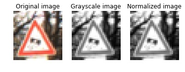

# **Traffic Sign Recognition** 

---

**Build a Traffic Sign Recognition Project**

The goals / steps of this project are the following:
* Load the data set (see below for links to the project data set)
* Explore, summarize and visualize the data set
* Design, train and test a model architecture
* Use the model to make predictions on new images
* Analyze the softmax probabilities of the new images
* Summarize the results with a written report

---

## Data Set Summary & Exploration

### 1. Basic Summary

I used the numpy library to calculate summary statistics of the traffic signs data set:

* The size of training set is 34799
* The size of the validation set is 4410
* The size of test set is 12360
* The shape of a traffic sign image is (32, 32, 3)
* The number of unique classes/labels in the data set is 43

### 2. Exploratory Visualization

#### 1. Training images for each class
The figure below shows one image of the training dataset for each class

#### 2. Distribution
The figure below shows the distribution of training, validation and test dataset. From this figure, we can see that there is a strong imbalance among the classes. The amount of images of each class is not evenly distributed. Some classes have adequate images, while some others have significantly fewer images. The imbalace may leads to overfitting. Besides, the good news is that the distribution of three dataset are similiar.

## Design and Test a Model Architecture

### 1. Preprocessing

As a first step, I decided to convert the images from RGB to grayscale because the color does not affect the classification. By doing this, the color channel will drop from 3 to 1, which will reduce the training time.

Then, I normalized the images by using its mean and standard deviation like this formula `(X - mean)/ stdev`. This operation converted the magnitude of the image into a zero mean range. Normalization is beneficial to the optimization. Because the networks learn by continually adding gradient error vectors (multiplied by a learning rate) computed from backpropagation to various weight matrices throughout the network. If we didn't scale our input training vectors, the ranges of our distributions of feature values would likely be different for each feature, and thus the learning rate would cause corrections in each dimension that would differ (proportionally speaking) from one another. We might be over compensating a correction in one weight dimension while undercompensating in another.

Below is an example of the preprossed image:

Here is an example of a traffic sign image before and after grayscaling.

### 2. Data Augmentation

I decided to generate additional data because the dataset is unbalanced, which may lead to overfitting. Therefore, I used the ImageDataGenerator class provided in the Keras library. During the training, the images will be slightly and randomly shifted, rotated, shered and zoomed.

Below is an example of the augmented images:

### 3. Model Architecture 
My model is modified base on the LeNet [LeNet](http://yann.lecun.com/exdb/publis/pdf/lecun-98.pdf). It consists of 2 convolutional blocks, each of which has a 5x5 convolutional layer, a relu layer, and a 2x2 maximum pooling layer, followed by a flatten layer and three fully connected layers. We added two dropout layer between those fully connected layers in order to aviod overfitting.

My final model consisted of the following layers:

| Layer         		|     Description	        					| 
|:---------------------:|:---------------------------------------------:| 
| Input         		| 32x32x1 grayscale image   				    | 
| Convolution 5x5     	| 1x1 stride, valid padding, outputs 28x28x6 	|
| RELU					|												|
| Max pooling	      	| 2x2 stride,  outputs 14x14x6 				    |
| Convolution 5x5	    | 1x1 stride, valid padding, outputs 10x10x16   |
| RELU					|												|
| Max pooling	      	| 2x2 stride,  outputs 5x5x16 				    |
| Flatten				| Input = 5x5x16. Output = 400					|
| Fully connected		| Input = 400. Output = 120			        	|
| RELU  				|            									|
| Dropout				| keep_prob = 0.75								|
| Fully connected		| Input = 120. Output = 84			        	|
| RELU  				|            									|
| Dropout				| keep_prob = 0.75								|
| Fully connected		| Input = 84. Output = 43			        	|

### 4. Training
The discussion can include the type of optimizer, the batch size, number of epochs and any hyperparameters such as learning rate.

To train the model, I used the following tools:
- Optimizer: Adam, which is the combination of SGDM and RMSProp and can training faster.
- Loss function: Cross entropy with l2 regularization, where L2 term can prevent overfitting by penalising large weights to reduce their effect. The final loss function is the average across all training images.
- Early stopping: Stop training when the validation accuracy no longer improves within ten epochs.
Hyperparameters:
- batch size: 128
- epochs: 100 with early stopping
- initial learning rate: 0.001
- l2_lambda: 0.0001
- keep prob of dropout: 0.75
- patience for early stopping: 10

### 5. Solution Approach

My final model results were:
* training set accuracy of 98.0%
* validation set accuracy of 93.7% 
* test set accuracy of 92.8%

Steps:
1. preprocess the dataset (including grayscale transformation, normalization, shuffling and data augmentation)
2. train and optimize the model by minimizing the loss function
3. Train the model until it reaches the condition of early stopping. Because if the epochs are not enough, the model may underfit. On the contrary, the model may overfit. Early stopping can ensure that our model is properly trained.

I built my model based on the LeNet architecture. The architecture was chosen as this architecture works when tackling the MNIST dataset classification task. There are similarities between those two datasets. For example, the image size of the traffic sign is also small (about 32x32 against 28x28). And these two tasks are both multi-class classification tasks. Besides, the LeNet architecture is very simple, which means that it wouldn't take too much time to train the model.

The figures below show the change of the accuracy and loss during training process:

 

## Test a Model on New Images

### 1. New german traffic signs

Here are six German traffic signs that I found on the web (the original images are at the top while the preprocessed are at the bottom):

Those images were from the GTSRB_Final_Test_Images. The first difficulty point is that the size of them is not uniform. Some of them are larger than 32x32, while some others are smaller. I resized them by using CV2 library. And these images were taken from the real world. Some of them have very noisy background such as the fourth image. It may affects the classification.

### 2. Predictions on t new traffic signs 

Here are the results of the prediction:

| Image			                            |     Prediction	        		     			| 
|:-----------------------------------------:|:-------------------------------------------------:| 
| Vehicles over 3.5 metric tons prohibited  | Vehicles over 3.5 metric tons prohibitedStop sign | 
| Speed limit (30km/h)    		            | Speed limit (30km/h) 					    		|
| Keep right					            | Keep right										|
| Turn right ahead	      		            |Turn right ahead					 				|
| Right-of-way at the next intersection		| Right-of-way at the next intersection      		|
| Right-of-way at the next intersection		| Right-of-way at the next intersection      		|

Below is the confusion matrix:
 

 
The model was able to correctly all of those traffic signs, which gives an accuracy of 100%. This compares favorably to the accuracy on the original test set. But this result is obtained on a smaller test data (only 6), so it may not be completely accurate.

### 3. Certainty

The code for making predictions on my final model is located in the 40th cell of the Ipython notebook.

The top five soft max probabilities are shown below:

 

For each image, the model was quite certain for its predictions.
