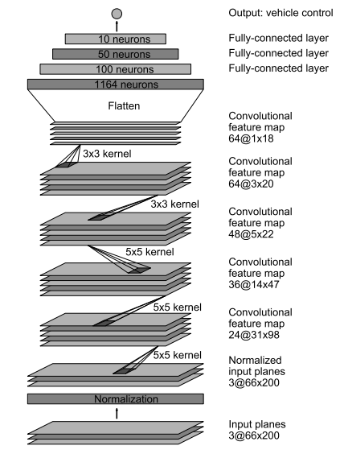
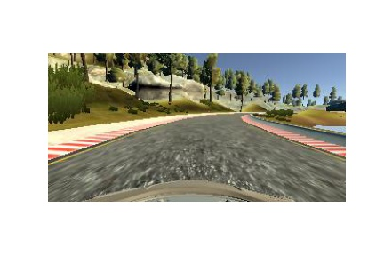
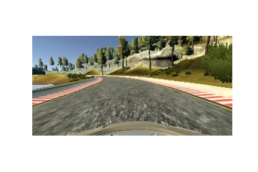
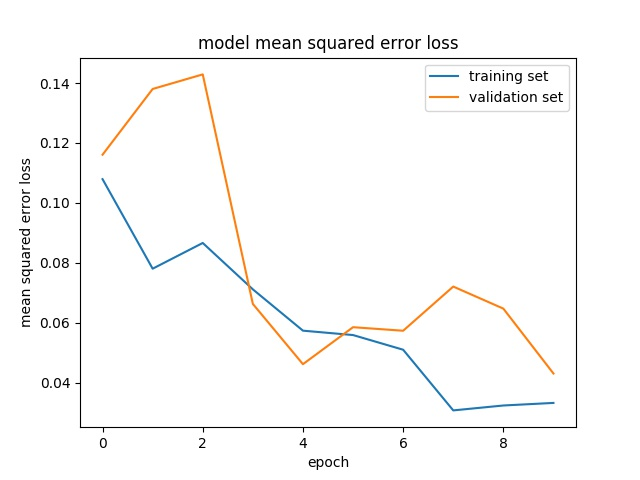

# **Behavioral Cloning** 

---

**Behavioral Cloning Project**

The goals / steps of this project are the following:
* Use the simulator to collect data of good driving behavior
* Build, a convolution neural network in Keras that predicts steering angles from images
* Train and validate the model with a training and validation set
* Test that the model successfully drives around track one without leaving the road
* Summarize the results with a written report


[//]: # (Image References)

[image1]: ./out_imgs/clr.jpg "Images Visualization"
[image2]: ./out_imgs/crop.jpg "Cropped image"

## Rubric Points
### Here I will consider the [rubric points](https://review.udacity.com/#!/rubrics/432/view) individually and describe how I addressed each point in my implementation.  

---
### Files Submitted & Code Quality

#### 1. Submission includes all required files and can be used to run the simulator in autonomous mode

My project includes the following files:
* model.py containing the script to create and train the model
* drive.py for driving the car in autonomous mode
* model.h5 containing a trained convolution neural network 
* writeup_report.md or writeup_report.pdf summarizing the results

#### 2. Submission includes functional code
Using the Udacity provided simulator and my drive.py file, the car can be driven autonomously around the track by executing 
```sh
python drive.py model.h5
```
and the frames can be obtained by running
```sh
python drive.py model.h5 run1
```
To obtain the video, run:
```sh
python video.py run1
```

#### 3. Submission code is usable and readable

The model.py file contains the code for training and saving the convolution neural network. The file shows the pipeline I used for training and validating the model, and it contains comments to explain how the code works.

### Model Architecture and Training Strategy

#### 1. An appropriate model architecture has been employed

My model is based on [NVidia network](https://arxiv.org/pdf/1604.07316v1.pdf) with some small modifications.
The first layer is a cropping layer (code line 58) which can crop the images into a smaller size (without 50 rows of pixels at the top and 20 rows of pixels at the bottom). This operation can improve the training efficiency.
![alt text][image1]
![alt text][image2]

The second layer is a lambda layer (code line 59) which can normalize the images in the range of -0.5 to 0.5.
The rest part of my network consists of 5 convolutional layers (code line 60-64) and 3 fully connected layers (code line 66-70). The depth of the convolutional layers is increased from 24 to 64. The kernel size of the first three convolutional layers is 5x5 (code line 60 to 62). The last two kernel sizes are 3x3 (code lines 63, 64). Between those fully connected layers are dropout layers (code lines 67, 69, 71) which are used to avoid overfitting.


#### 2. Attempts to reduce overfitting in the model

* The model contains dropout layers in order to reduce overfitting (model.py (code lines 67, 69, 71)). 
* Augment the dataset by flipping the images
* Use auxiliary self collected images to extend the dataset
* The model was trained and validated on different data sets to ensure that the model was not overfitting (code line 76-89). The model was tested by running it through the simulator and ensuring that the vehicle could stay on the track.

#### 3. Model parameter tuning

The model used an adam optimizer, so the learning rate was not tuned manually (model.py line 145).

#### 4. Appropriate training data

Training data was chosen to keep the vehicle driving on the road. I used a combination of center lane driving, recovering from the left and right sides of the road. 

For details about how I created the training data, see the next section. 

### Model Architecture and Training Strategy

#### 1. Solution Design Approach

The overall strategy for deriving a model architecture was to build a basic network such as LeNet. But I thought this network is too simple to this task. We might need some powerful network. So, I followed the suggestion of this course and choose the Nvidia network.

In order to gauge how well the model was working, I split my image and steering angle data into a training and validation set. I found that my first model had a low mean squared error on the training set but a high mean squared error on the validation set. This implied that the model was overfitting. 

To combat the overfitting, I modified the model by adding dropout layers and augmented the dataset by adding the flipped images.

The final step was to run the simulator to see how well the car was driving around track one. There were a few spots where the vehicle fell off the track. To improve the driving behavior in these cases,  I changed the correction from 0.2 to 0.4. And I found that the vehicle run out of the road when it need to turn right. So I collected the images by running the car in the inverse direction.

At the end of the process, the vehicle is able to drive autonomously around the track without leaving the road.

#### 2. Final Model Architecture

The final model architecture (model.py lines 51-72) is based on NVidia network.

Here is a visualization of the architecture:

<center></center>
The cropping layer and lambda layer are not visualized in the above figure.

#### 3. Creation of the Training Set & Training Process

To capture good driving behavior, I first recorded two laps on track one using center lane driving. Here is an example image of center lane driving:

<center></center>


I then recorded the vehicle recovering from the left side and right sides of the road back to center so that our model could have more information about how to turn left and right.

![alt text][image1]

To augment the data sat, I also flipped images and angles. For example, here is an image that has then been flipped:

<center></center>


After the collection process, I had 48324 number of data points. I finally randomly shuffled the data set and put 20% of the data into a validation set. 

I used this training data for training the model. The validation set helped determine if the model was over or under fitting. The ideal number of epochs was 10 as evidenced by the increased validation error due to overfitting. I used an adam optimizer so that manually training the learning rate wasn't necessary.

<center></center>