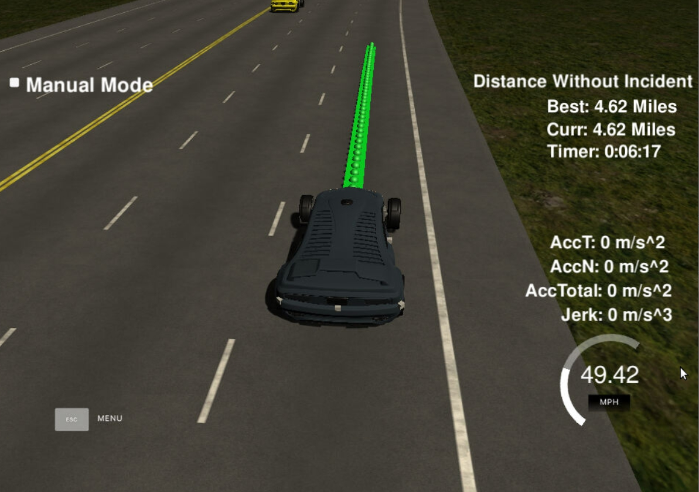

# **Highway Driving**
---
The goal of this project is to build a path planner that creates smooth, safe trajectories for the car to follow. The path planing algorithm should assure that:
* the car can drive at least 4.32 miles without incident (exceeding acceleration/jerk/speed, collision, and driving outside of the lanes)
* the car does not have collisions with other cars
* the car can change lanes safely 

---
## Basic Build Instructions

1. Clone this repo.
2. Make a build directory: `mkdir build && cd build`
3. Compile: `cmake .. && make`
4. Run it: `./path_planning`.

---
## Details

1. The car uses a perfect controller and will visit every (x,y) point it recieves in the list every .02 seconds. The units for the (x,y) points are in meters and the spacing of the points determines the speed of the car. The vector going from a point to the next point in the list dictates the angle of the car. Acceleration both in the tangential and normal directions is measured along with the jerk, the rate of change of total Acceleration. The (x,y) point paths that the planner recieves should not have a total acceleration that goes over 10 m/s^2, also the jerk should not go over 50 m/s^3. (NOTE: As this is BETA, these requirements might change. Also currently jerk is over a .02 second interval, it would probably be better to average total acceleration over 1 second and measure jerk from that.

2. There will be some latency between the simulator running and the path planner returning a path, with optimized code usually its not very long maybe just 1-3 time steps. During this delay the simulator will continue using points that it was last given, because of this its a good idea to store the last points you have used so you can have a smooth transition. previous_path_x, and previous_path_y can be helpful for this transition since they show the last points given to the simulator controller with the processed points already removed. You would either return a path that extends this previous path or make sure to create a new path that has a smooth transition with this last path.

---
## Input / Output
### Input
The input from the simulator takes the form of a JSON object and consists of:

#### Main car's localization Data (No Noise)

["x"] The car's x position in map coordinates

["y"] The car's y position in map coordinates

["s"] The car's s position in frenet coordinates

["d"] The car's d position in frenet coordinates

["yaw"] The car's yaw angle in the map

["speed"] The car's speed in MPH

#### Previous path data given to the Planner

//Note: Return the previous list but with processed points removed, can be a nice tool to show how far along
the path has processed since last time. 

["previous_path_x"] The previous list of x points previously given to the simulator

["previous_path_y"] The previous list of y points previously given to the simulator

#### Previous path's end s and d values 

["end_path_s"] The previous list's last point's frenet s value

["end_path_d"] The previous list's last point's frenet d value

#### Sensor Fusion Data, a list of all other car's attributes on the same side of the road. (No Noise)

["sensor_fusion"] A 2d vector of cars and then that car's [car's unique ID, car's x position in map coordinates, car's y position in map coordinates, car's x velocity in m/s, car's y velocity in m/s, car's s position in frenet coordinates, car's d position in frenet coordinates. 

### Highway Map
In addition to the data provided by the simulator, the motion planner also provides a file containing a map of the highway track. The track contains a total of 181 waypoints, with the last waypoint mapping back around to the first. 

The track is 6945.554 meters (approximately 4.32 miles), so a car with an average speed of nearly 50 mph will take a little more than 5 minutes to complete a lap.

#### Waypoint Data
Each waypoint consists of:

["x"] x map coordinate

["y"] y map coordinate

["s"] distance along the direction of the road

["d"] vector with magnitude of 1 perpendicular to the road in the driving direction

### Output
### Trajectory

A set of points for the car to reach every 20 ms:

["x"] The car's x position in map coordinates

["y"] The car's y position in map coordinates

---
## Motion planner

The motion planner consists of three steps:

1. Prediction: use data from sensor fusion to generate predictions of the state of the moving objects
2. Behaviour Planning: determine maneuvers to be planned
3. Trajectory Planner: generate trajectory for the selected maneuver

### Prediction
---
This module uses sensor fusion data to predict the state (position, speed etc.) of the other vehicles relative to the ego car. 

For each detected car, the car's lane, speed and position is determined:

`main.cpp (lines: 131 - 154):`
```cpp
float d = sensor_fusion[i][6];
// Check if any car is in the same lane of our car
// Assume there are 3 lanes, left, right and our lane
// lane width = 4, if d<4, the car is in the left lane
// if 4<d<=8, the car is in the middle lane, otherwise, it's in the right lane
if (d <= 4){
    car_lane = 0;
}
else if (d > 4 && d <= 8){
     car_lane = 1;
}
else if (d > 8 && d <=12){
     car_lane = 2; 
}
            
// Save the car's measurements
double other_car_vx = sensor_fusion[i][3];
double other_car_vy = sensor_fusion[i][4];
double other_car_s_position = sensor_fusion[i][5];
double other_car_speed = sqrt(other_car_vx * other_car_vx + other_car_vy * other_car_vy);
            
// Project this car's position in the future
// timestep used by simulator is 0.02
other_car_s_position += ((double) prev_size * 0.02 * other_car_speed);
```

#### Safe Distance
Based on the predicted state of other cars, distance from the ego car to a car in the same lane is also checked to maintain a safe distance and avoid collisions:

`main.cpp (lines: 157 - 164):`
```cpp
// Check if the other car is in front of our car within a certain range (30m)
bool within_certain_gap = abs(other_car_s_position - car_s) < 30;
if (car_lane == lane && (other_car_s_position > car_s) && within_certain_gap){
    // Set a flag if our car being too close to another one in the same lane
    is_too_close = true;
    // Set a flag to prepare to switch lanes
    switch_lane = true;
}
```

#### Lane Occupancy
In the event a lane switch is required, the module also predicts which lane has a minimum safety gap available for the ego vehicle to switch to:

`main.cpp (lines: 165 - 172):`
```cpp
else if (car_lane == (lane-1) && within_certain_gap){
    // The other car is in the left lane
    is_left_lane_available = false;
}
else if (car_lane == (lane+1) && within_certain_gap){
     // The other car is in the right lane
     is_right_lane_available = false;
}
```

### Behaviour Planning
---
This module takes the predictions made above and uses them to guide the vehicle behaviour.

#### Physical Limits
It ensures the vehicle drives according to the law of physics (i.e. exhibits smooth driving with minimal jerk (<10m/s^3) and acceleration (<10m/s^2)) and remains within the highway speed limit of 50 mph:

`main.cpp (lines: 179 - 181):`
```cpp
else if (curr_vel < 49.5){
     curr_vel += 0.224;
}
```

#### Collision Avoidance
If the ego vehicle is too close to a vehicle in front, it reduces speed to maintain distance and avoid a collision:

`main.cpp (lines: 176 - 178):`
```cpp
if (is_too_close){
    curr_vel -= 0.224;
}
```

#### Lane Switching
When obstructed by a car in front, the ego vehicle will attempt to switch lanes if the conditions are met. Namely, if there is a lane available on either side with sufficient gap to make the switch:

`main.cpp (lines: 183 - 191):`
```cpp
// Switch lanes if available
if (switch_lane){
   if (is_left_lane_available && lane > 0){
      lane -= 1;
   }
   else if (is_right_lane_available && lane < 2){
        lane += 1;
   }
}
```

If there is no obstruction, the default behaviour is to continue to follow the current lane.

### Trajectory Planner
---
Given the current position and desired behaviour as determined by the behaviour module, the trajectory planner creates a smooth trajectory using splines.

#### Previous Path Points
The simulator runs a cycle every 20 ms (50 frames per second) but a new path is always provided with one cycle latency. The planner can't receive and send data simultaneously.

To ensure a smooth transition between frames, unexecuted path points from the previous cycle are returned by the simulator and used as the starting point for the next trajectory:

`main.cpp (lines: 253 - 253):`
```cpp
for (int i=0; i<prev_size; ++i){
    next_x_vals.push_back(previous_path_x[i]);
    next_y_vals.push_back(previous_path_y[i]);
}
```

#### Waypoint Generation
The start of the next trajectory is the end of the previous path. If there is no previous path, the previous path is extrapolated from the current state of the ego vehicle.
`main.cpp (lines: 202 - 226):`
```cpp
if (prev_size < 2 ){
    double prev_car_x = ref_x - cos(ref_yaw);
    double prev_car_y = ref_y - sin(ref_yaw);
          
    // Add the previous points and current state to the list
    list_xpts.push_back(prev_car_x);
    list_xpts.push_back(ref_x);
    list_ypts.push_back(prev_car_y);
    list_ypts.push_back(ref_y);
}
else {
     // If there are more previous points, redefine the current state by using the endpoint and the second last point
     ref_x = previous_path_x[prev_size - 1];
     ref_y = previous_path_y[prev_size - 1];
            
     double prev_ref_x = previous_path_x[prev_size - 2];
     double prev_ref_y = previous_path_y[prev_size - 2];
            
     ref_yaw = atan2(ref_y - prev_ref_y, ref_x - prev_ref_x);
             
     list_xpts.push_back(prev_ref_x);
     list_xpts.push_back(ref_x);
     list_ypts.push_back(prev_ref_y);
     list_ypts.push_back(ref_y);     
}

```
Frenet coordinates are used to calculate the waypoints in the trajectory as they make it easier to keep the car in the middle of the lane. They are converted to x-y coordinates for creating the trajectory:

`main.cpp (lines: 229 - 237):`
```cpp
vector<double> next_wp0 = getXY(car_s+30, (2+4*lane), map_waypoints_s, map_waypoints_x, map_waypoints_y);
vector<double> next_wp1 = getXY(car_s+60, (2+4*lane), map_waypoints_s, map_waypoints_x, map_waypoints_y);
vector<double> next_wp2 = getXY(car_s+90, (2+4*lane), map_waypoints_s, map_waypoints_x, map_waypoints_y);
list_xpts.push_back(next_wp0[0]);
list_xpts.push_back(next_wp1[0]);
list_xpts.push_back(next_wp2[0]);
list_ypts.push_back(next_wp0[1]);
list_ypts.push_back(next_wp1[1]);
list_ypts.push_back(next_wp2[1]);
```

#### Spline Generation
The generated waypoints are used as spline points to initialise a spline. 

`main.cpp (lines: 248):`
```cpp
tk::spline s;
```

The spline is then used to generate break points that form the trajectory. Based on the horizon distance considered for the trajectory, the number of break points to use in the trajectory is calculated using Pythagoras' theorem:

`main.cpp (lines: 259 - 261):`
```cpp
double target_x = 30.0;
double target_y = s(target_x);
double target_distance = sqrt(target_x*target_x + target_y*target_y);
```

The spline is evaluated at these points to form the trajectory:

`main.cpp (lines: 263 - 284):`
```cpp
double x_add_on = 0;
          
for (int i=1; i<=50-previous_path_x.size(); ++i){
    double N = target_distance/(0.02 * curr_vel /2.24);
    // Generate x and y spline points
    double x_point = x_add_on + target_x/N;
    double y_point = s(x_point);
    x_add_on = x_point;
    // Transform back to global frame
    double x_ref = x_point;
    double y_ref = y_point;
            
    // Rotate from the car's coordinate system to the map coordinate system
    x_point = x_ref * cos(ref_yaw) - y_ref * sin(ref_yaw);
    y_point = x_ref * sin(ref_yaw) + y_ref * cos(ref_yaw);
            
    x_point += ref_x;
    y_point += ref_y;
            
    next_x_vals.push_back(x_point);
    next_y_vals.push_back(y_point);
}
```

The generated points form the trajectory and are sent to the simulator to execute on the ego vehicle.

## Result
---

<center>

</center>
<br>
---
## Dependencies

* cmake >= 3.5
  * All OSes: [click here for installation instructions](https://cmake.org/install/)
* make >= 4.1
  * Linux: make is installed by default on most Linux distros
  * Mac: [install Xcode command line tools to get make](https://developer.apple.com/xcode/features/)
  * Windows: [Click here for installation instructions](http://gnuwin32.sourceforge.net/packages/make.htm)
* gcc/g++ >= 5.4
  * Linux: gcc / g++ is installed by default on most Linux distros
  * Mac: same deal as make - [install Xcode command line tools]((https://developer.apple.com/xcode/features/)
  * Windows: recommend using [MinGW](http://www.mingw.org/)
* [uWebSockets](https://github.com/uWebSockets/uWebSockets)
  * Run either `install-mac.sh` or `install-ubuntu.sh`.
  * If you install from source, checkout to commit `e94b6e1`, i.e.
    ```
    git clone https://github.com/uWebSockets/uWebSockets 
    cd uWebSockets
    git checkout e94b6e1
    ```